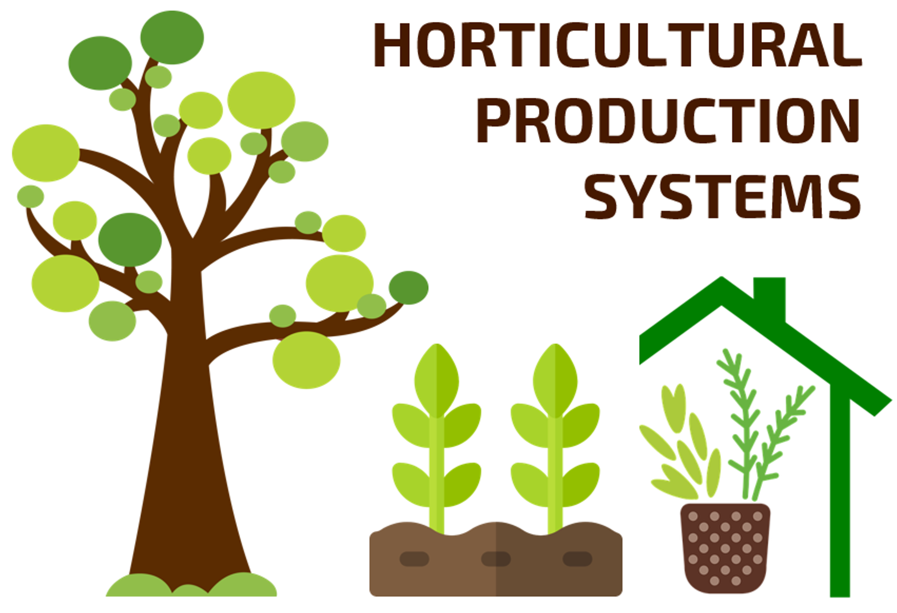
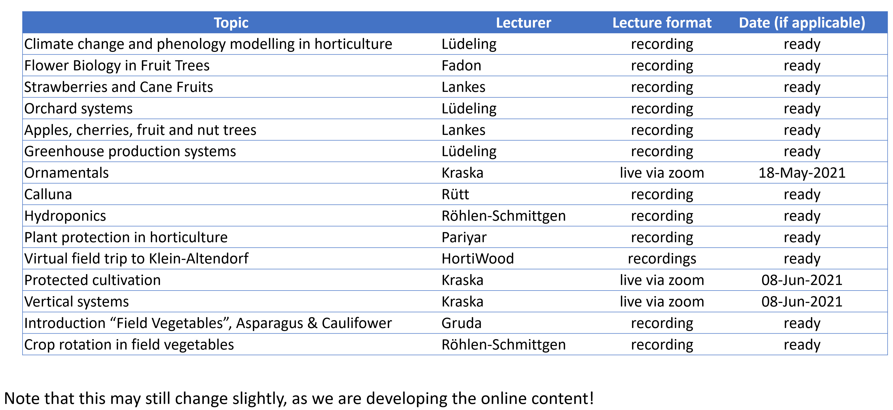
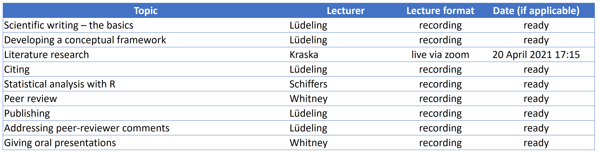
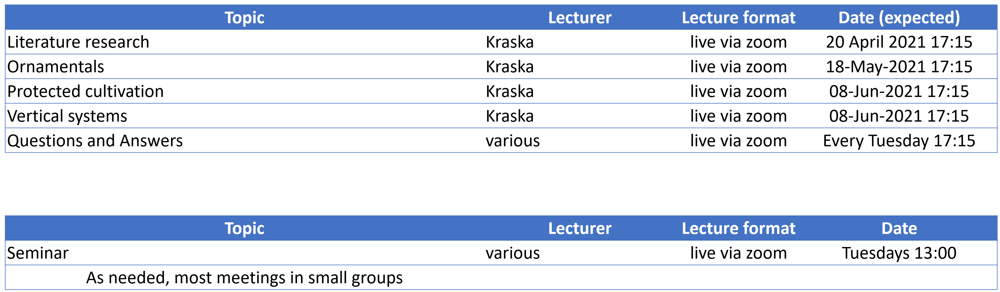
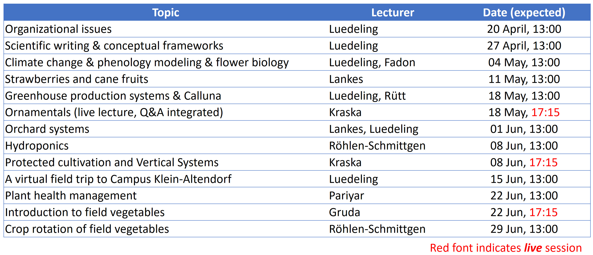
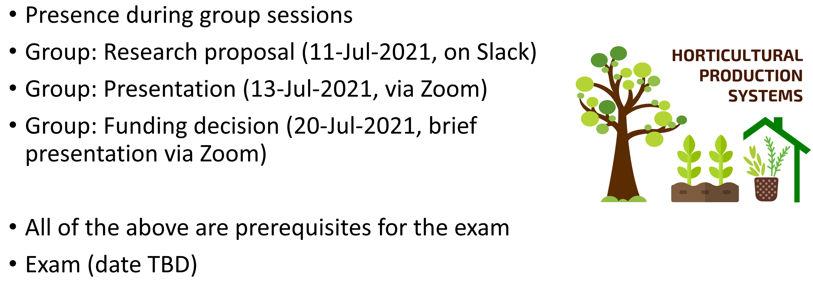

# {width=90%} {-#header}

**Welcome to Horticultural Production and Research**

*by Eike Luedeling*

This is a module offered to students of the MSc programs of [Crop Science](https://www.lf.uni-bonn.de/en/studying/master/npw) and [Agricultural Sciences and Resource Management in the Tropics and Subtropics (ARTS)](https://www.arts.uni-bonn.de/) at the [University of Bonn](https://www.uni-bonn.de/the-university?set_language=en).

Let me quickly introduce myself. My name is [Eike Luedeling](http://www.hortibonn.de/author/prof.-dr.-eike-luedeling/), and I lead the [Horticultural Sciences group](http://www.hortibonn.de) in the [Institute of Crop Science and Resource Conservation (INRES)](https://www.inres.uni-bonn.de/collage-startseite-1-en?set_language=en). In bringing this module to you, I'm supported by a strong team, including [Erica Fadón](http://www.hortibonn.de/author/dr.-erica-fadon-adrian/), [Christa Lankes](http://www.hortibonn.de/author/dr.-christa-lankes/), [Thorsten Kraska](http://www.hortibonn.de/author/dr.-thorsten-kraska/), [Marius Rütt](http://www.hortibonn.de/author/marius-ruett/), [Simone Röhlen-Schmittgen](https://www.hs-geisenheim.de/personen/person/1067/), [Cory Whitney](http://www.hortibonn.de/author/dr.-cory-whitney/), [Shyam Pariyar](http://www.hortibonn.de/author/dr.-shyam-pariyar/) and [Nazim Gruda](http://www.hortibonn.de/author/prof.-dr.-nazim-gruda/).

# Introduction {-#intro}

The materials assembled on this website support the lecture on **Horticultural Production Systems** in the Summer Semester of 2021. Since we're currently in "Pandemic mode", it's very unlikely that we'll be able to do any real field trips. We'll try to make up for this by offering some video materials that we recorded over the past few months. We'll also put extra effort into the other parts of the class, so hopefully you won't even notice that you're missing something.

## Module content {-#modulecontent}

This module consists of two parts: a lecture series, where you'll learn about a range of aspects related to Horticultural Production Systems, and a seminar, where you'll learn a bit about science in general, and scientific writing in particular. To get some hands-on experience in scientific writing, you'll be teaming up with some of your colleagues to develop a research proposal together.

The seminar will happen every Tuesday from 13:00-13:45, the lecture slot is Tuesday from 17:15-20:00.

Most of the lectures will be pre-recorded, so you can watch them at your own time, but we'll be offering Q&A sessions at 17:15 every Tuesday.

All live sessions will be held via zoom, so please make sure you have adequate equipment to participate.

## Communication {-#communication}

You'll receive most information related to the class via this website.

You'll also receive an invitation to join the Slack workspace for this module. [Slack](https://slack.com/intl/en-de/) is a platform that facilitates collaboration within teams or organizations that we've found very effective for organizing class contents. The invitation to Slack will come via email. Please sign up with your university email address. We'll share announcements through Slack, and we also encourage you to organize your group work via this platform. You'll get a brief introduction into Slack in our first session.

## Grading {-#grading}

There will be an exam at the end of this module, which counts for 50% of the grade. The other 50% will be based on the research proposal you develop as a group, as well as an oral presentation/pitch of your research idea to your colleagues. It looks like all of this will have to happen online - we'll let you know in good time how we're planning to do the exam.

## Lecture topics {-#lecturetopics}

This module includes lectures on the following topics:

- [Climate change and phenology modelling in horticulture]
- [Flower biology in temperate fruit trees]
- [Strawberries and cane fruits]
- [Greenhouse production systems]
- [Orchard systems I]
- [Orchard systems II]
- [Ornamentals, with case study on *Calluna*]
- [Hydroponics]
- [Protected cultivation and Vertical Systems]
- [Plant health management]
- [Introduction to field vegetables]
- [Crop rotation of field vegetables]

There may still be some updates to this list as the semester unfolds. Note that not all materials have been updated from last year. You'll see when it's time to check out the materials, when there is a date next to the titles above. From that date on you can also ask questions regarding these topics in the Q&A session (though not all lecturers will always be there). For most topics, you can also ask questions via Slack.

In addition to the lectures, we prepared some instruction materials on [Scientific writing] and scientific procedures more generally:

- [Scientific writing – the basics]
- [Developing a conceptual framework]
- [Literature research]
- [Citing]
- [Statistical analysis with R]
- [Peer review]
- [Publishing]
- [Addressing peer-reviewer comments]
- [Giving oral presentations]

## Schedule and lecture status overview {-#schedlec}

### Lectures {-#schedlec1}

### Seminar sessions {-#schedlec2}

### Live zoom sessions {-#schedlec3}

### Question and answer sessions and topics {-#QAsess}

### Deliverables {-#schedlec4}

